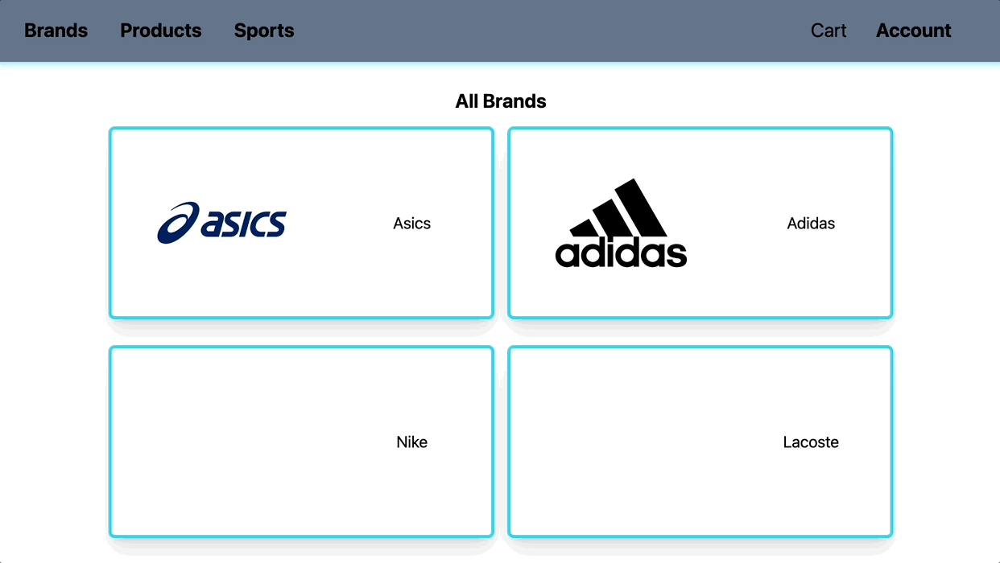

# Sports Store Shopper

<h3>Demo GIF</h3>

<a href="https://sports-store-shopper.herokuapp.com/" target="_blank" rel="noopener noreferrer">Try it yourself here!</a>

<h2>Summary</h2>

Sports Store Shopper is a CRUD application managing the items held in a sport's store inventory. Users have the ability to add new brands and products as well as adding existing products to their shopping cart.

 <h2>Technologies Used:</h2>
  <ul>
  <li>Express</li>
  <li>NodeJS</li>
  <li>MongoDB</li>
  <li>Pug</li>
  <li>AWS S3 Bucket</li>
  <li>Passport - for user authentication</li>
  <li>csurf for CSRF protection</li>
 </ul>

 <h2>Features:</h2>
 <ul>
  <li>Images for product/brand/sports hosted with S3</li>
  <li>Responsive design</li>
  <li>Create/Update/Delete product/brands/sports</li>
  <li>Amazon S3 bucket used to host images</li>
 </ul>
 

 ---

<h3>Please reach out with any comments!</h3>
